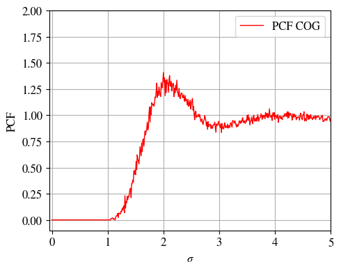

# parallel-pcf
A Python script for parallel calculation of pair correlation functions of simulation trajectories


### Prerequisites
Several python packages are needed:
```
MDAnalysis
matplotlib
multiprocessing
numpy
ctypes
```

### Running

An exemplary Brownian Dynamics simulation trajectory of
343 coarse-grained, 6-sited molecules containing 100 frames
is provided in 'traj.gsd'. By running

```
$ python main.py
```
the script will automatically use all available CPU threads
to calculate the pair-correlation function of centers-of-mass
of all molecules, more precisely:


\
It will output the result in 'pcf.dat' and also a produce a graph 'pcf.png':


